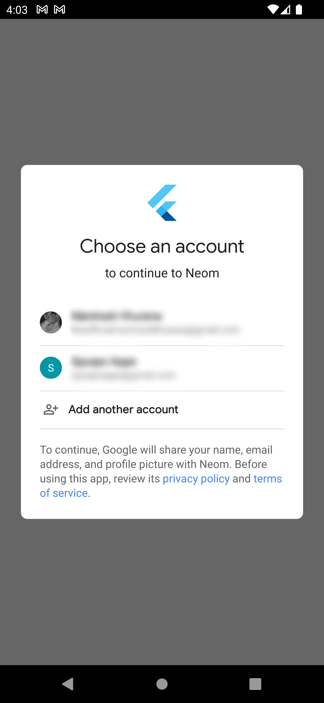

# Neom

A firebase based app which allows users to login using there google account.
> Note: This project won't be maintained on a regular basis this is just for my college project. For more check [contributing](#contributing).

## Screenshots

Screenshots are just for reference use the apk to get a better idea.

| Login Screen | Google Screen | Home Screen |
| :---: | :---: | :---: |
|  |  |  |

## Prerequisites

- [Flutter](https://flutter.dev/docs/get-started/install)
- [Android Studio](https://developer.android.com/studio)
- [Xcode (macOS Only)](https://developer.apple.com/xcode/)
- [VS Code](https://code.visualstudio.com/)

## Packages Used

All the packages used in this project are listed below, they are all available on [pub.dev](https://pub.dev/).

- [firebase_auth](https://pub.dev/packages/firebase_auth)
- [firebase_core](https://pub.dev/packages/firebase_core)
- [skeleton_animation](https://pub.dev/packages/skeleton_animation)
- [animate_do](https://pub.dev/packages/animate_do)

## Installation

```bash
git clone https://github.com/ishan170/neom.git
cd neom
flutter pub get
```

## Usage

```bash
flutter run
```

## Build

Debug apps tend to work slower than release apps, so it is recommended to build release apps using your own keystore. For now you can build debug apps using the following command:

```bash
flutter build apk --debug
```

## Contributing

Pull requests are welcome, but please open an issue first to discuss what you would like to change.

Steps to contribute:

1. Fork the [Repository](https://github.com/ishan170/neom.git).
2. Create your feature branch (`git checkout -b feature`).
3. Commit your changes (`git commit -m 'Added some feature'`).
4. Push to the branch (`git push origin feature`).
5. Open a pull request.
6. Wait for review.

## Author

- [Ishan](https://github.com/ishan170)

## Credits

- [Flutter](https://flutter.dev/)
- [unDraw](https://undraw.co/illustrations)
